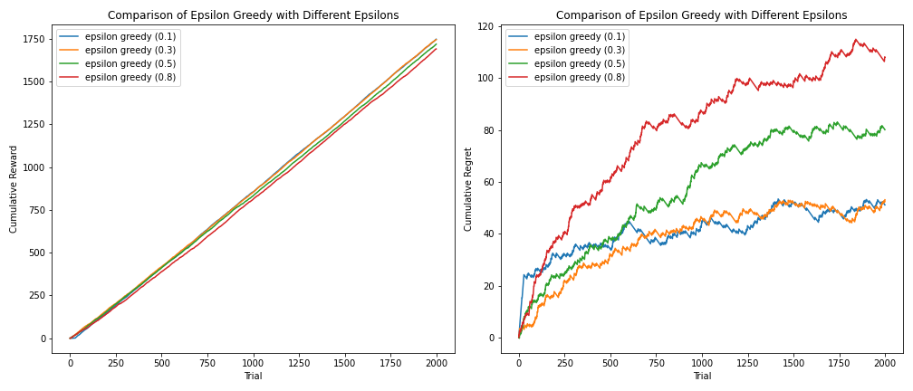
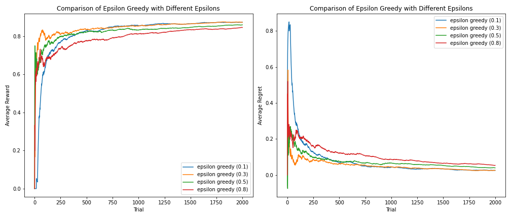
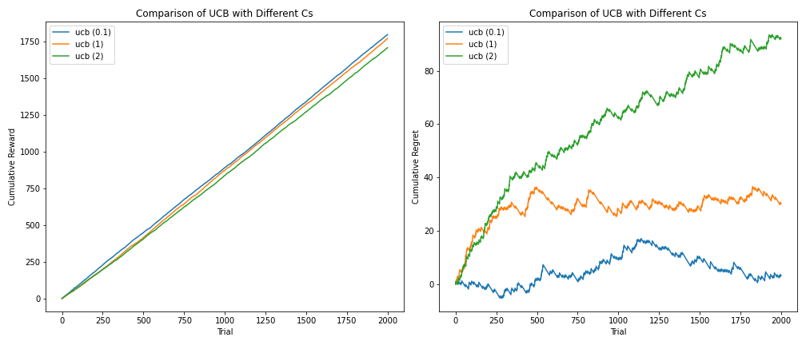
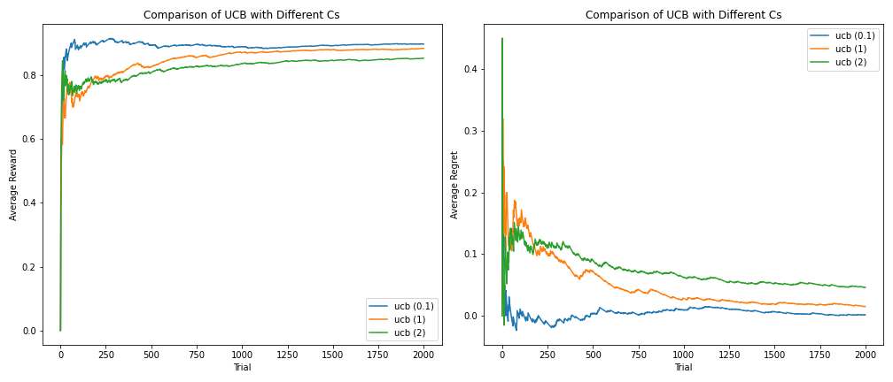
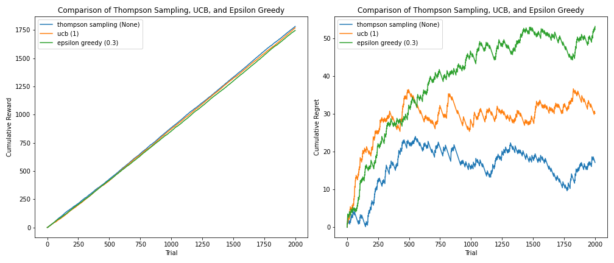
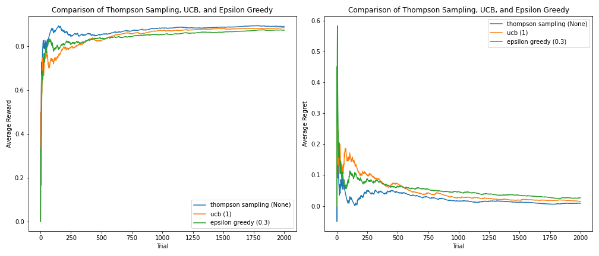
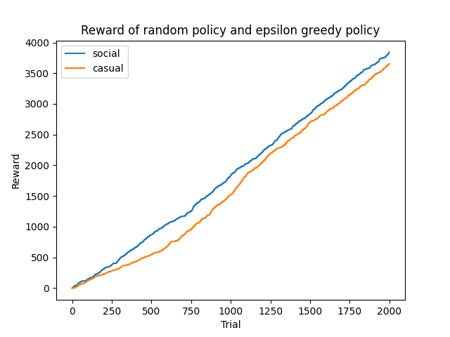

# CA 1, Interactive Learning, Fall 2024
- **Name**: Majid Faridfar
- **Student ID**: 810199569
## Problem 1 (Food Recommendation System)
### Investigating the Effect of Changing Parameters

I explored two things in this section: 1) Effect of **different epsilons** on an RL agent following epsilon greedy policy, and 2) Effect of **different c's** on an RL agent following UCB policy.

#### Value-Based Epsilon Greedy with Different Epsilons

Note that for all four agents, $\epsilon$ decreases over time, with the following formula:

$$\epsilon = max(0.05, \epsilon*0.998)$$

It is grantueed that $\epsilon$ never becomes $0$ (its minimum value is set to $0.05$), to always maintain a little possibility of exploring new actions. It is also imporatant that without decreasing the value of $\epsilon$, algorithms never converges! So, we need to do this actually.

<!-- My interpretations of the above plots are as follows:

1. Since the agent with $\epsilon = 0.8$  explores the environment more than others at early steps, it follows a somewhat random behaviour for a longer time. So, the amount of cumulative reward it receives remains less than others. Also, the figure for cumulative regret is not only more than other agents with fewer epsilons, but it also starts leveling out later compared to other agents with fewer epsilons.
2. The agents with $\epsilon = 0.1$ and $0.3$ rely on their experience more than two other agents. As a result, they converge faster, meaning that they find the optimal action quickly and consequently start doing it earlier resulting in better results. To clarify, not only is their cumulative regret less, but the cumulative reward they receive is more than agents with $\epsilon = 0.5$ and $0.8$, over time. -->

---

**Average Reward**

1. **ε = 0.1** (blue):
   - **Low exploration** (only 10% of the time) and mainly focuses on exploiting the current best-known action.
   - This ε value shows the **slowest initial rise**, then gradually reaches an **optimal average reward**. This suggests that the policy only occasionally explores, leading to slower learning in the short term but reliable exploitation over time.
   
2. **ε = 0.3** (orange):
   - **More exploration** leads to a **faster initial rise** in reward (sharper convergence). This means it discovers good actions faster than ε = 0.1, leading to a the quickest adaptation in early trials overall.
   - However, after the initial surge, it converges to a reward close to ε = 0.1, meaning exploitation dominates and optimal actions are discovered eventually.

3. **ε = 0.5** (green):
   - With **50% exploration**, the agent experiences more stochastic behavior. It has a minor degradation in average reward compared to lower ε values (0.1 and 0.3). This suggests that too much exploration can hurt performance because the agent often tries suboptimal actions.
   
4. **ε = 0.8** (red):
   - The high exploration rate (exploring 80% of the time) leads to **slower convergence** and **lower average reward**. Because the agent explores most of the time, it struggles to fully exploit the best actions, often staying in suboptimal regions for longer.

---

**Average Regret**

1. **ε = 0.1** (blue):
   - Initially, the regret is high because the agent is primarily exploiting and not learning about the environment fast enough.
   - Over time, the regret decreases steadily as the agent comes to exploit the optimal actions it has found. This is the lowest long-term regret, which matches the intuition that mostly exploiting what is known to work eventually leads to minimal regret.

2. **ε = 0.3** (orange):
   - The agent starts with high regret but decreases quickly. The balance between exploration and exploitation reduces regret faster than ε = 0.1, as it learns the environment more efficiently while also reducing regret in the long run.
   
3. **ε = 0.5** (green):
   - Unlike the previous two, this agent explores much more, so it has higher regret in the early phases. After some time, it learns reasonably well, but the regret remains higher than ε = 0.1 and ε = 0.3 due to the larger exploration factor.
 
4. **ε = 0.8** (red):
   - The high exploration rate causes this agent to explore far too often, leading to the most **significant early regret** and the **sloweest convergence**. Even later in the trials, it has the highest average regret, indicating that excessive exploration hinders the agent from fully exploiting the best-known actions.

---

**Cumulative Reward**

1. **ε = 0.1** (blue):
   - The lowest exploration value results in the agent accumulating **consistent rewards** throughout the trials, showing nearly linear growth. This suggests the agent exploits the environment and reaches a stable level of performance.
   
2. **ε = 0.3** (orange):
   - A slightly higher exploration factor allows the agent to quickly discover good actions, so it accumulates **rewards faster early** on, though it converges similarly to ε = 0.1.

3. **ε = 0.5** (green):
   - The 50% exploration policy causes slower accumulation of rewards in the long run compared to lower ε values. The agent spends more time exploring non-optimal actions, thus gaining rewards at a slower rate.
   
4. **ε = 0.8** (red):
   - The highest exploration rate causes this agent to accumulate rewards slower than other policies. Much of the agent's time is spent exploring, limiting its ability to continuously exploit high-reward actions.

---

**Cumulative Regret**

1. **ε = 0.1** (blue):
   - The agent starts with low cumulative regret, and it remains the **lowest** throughout. This is expected since the agent spends most of its time exploiting the best-known action and incurs less cost from exploration.

2. **ε = 0.3** (orange):
   - More exploration initially leads to slightly higher cumulative regret, although it remains relatively low in the long term and also in the early trials (it shows the lowest figure by the 750th trial). This indicates that quickly learning the environment yields rewards that mitigate regret effectively.
   
3. **ε = 0.5** (green):
   - Higher exploration causes the agent to accumulate regret at a higher rate initially, and over time, the cumulative regret is still higher than for strategies with lower ε, however it is leveling out slower.
   
4. **ε = 0.8** (red):
   - Excessive exploration causes substantial cumulative regret. This is the highest, and it continues to accumulate at a higher rate across trials. The agent spends too much time exploring, rendering it less effective at exploiting good actions, so regret builds up constantly.

---

**Overall Interpretation**:
- **Low ε (such as 0.1)** values lead to **slower initial learning**, but once the agent has learned the best actions, it can consistently exploit them, resulting in **higher cumulative rewards** and **lower cumulative regret** in the long run.
- **Moderate ε (0.3)** offers a good balance, fast learning with good long-term performance. It's a sweet spot between exploration and exploitation.
- **High ε (such as 0.8)** results in **faster learning early on**, but the excessive exploration harms the agent's ability to accumulate long-term rewards, leading to **higher regret** and **lower cumulative reward**.

---

#### UCB with different c's

Note that the **UCB policy** selects actions based on balancing **exploitation** (choosing the known best rewards) and **exploration** (trying actions with higher uncertainty). The formula typically is:

$$A_t = \arg\max_a \left( \hat{\mu}_a + c \times \sqrt{\frac{\log t}{n_a}} \right)$$

Where:
- $\hat{\mu}_a$ is the average reward obtained from action$ a$,
- $t$ is the number of trials,
- $n_a$ is the number of times action$ a$ has been taken,
- $c$ is a hyperparameter that controls the trade-off between **exploration** and **exploitation**:
  - **Higher $c$** means more aggressive exploration.
  - **Lower $c$** means favoring exploitation earlier.

---

**Average Reward**

1. **c = 0.1** (blue line):
    - This lower value of c leads to more *exploitation* and less *exploration*, allowing the agent to quickly exploit higher-reward actions.
    - We notice faster convergence to a high average reward, and it consistently performs better than higher values of c over time.
    - The agent tends to stabilize at the highest average reward, indicating that it has been able to focus on the best action more aggressively.

2. **c = 1** (orange line):
    - A slightly higher value of c introduces more exploration but still emphasizes exploitation significantly.
    - The average reward takes longer to converge compared to c = 0.1, and it achieves a slightly lower long-term reward.

3. **c = 2** (green line):
    - For this value of c, the agent explores more aggressively, leading to slower convergence in finding the optimal action.
    - The average reward remains lower even after many trials due to excessive exploration, which keeps the agent from spending enough time exploiting the optimal actions.

---

**Average Regret**

1. **c = 0.1** (blue line):
    - With minimal exploration, the regret remains the lowest for most of the trials.
    - The agent quickly converges to optimal actions, resulting in minimal deviation from the best possible rewards.
    
2. **c = 1** (orange line):
    - Regret is higher early on, as the agent explores different actions, but declines quickly as the agent locks onto the better actions.
    - The regret stabilizes at a higher level than the c = 0.1 case, due to a higher exploration rate.

3. **c = 2** (green line):
    - The regret remains persistently higher in this case, especially early in the process, due to more frequent exploration of suboptimal actions.
    - Even after many trials, the agent doesn't settle on optimal actions, and regret plateaus at the highest level.

---

**Cumulative Reward**

1. **c = 0.1** (blue line):
    - The cumulative reward grows steadily and remains consistently above other configurations due to quick exploitation of high-reward actions.
    
2. **c = 1** (orange line):
    - The cumulative reward grows slightly slower than c = 0.1 and remains below it, indicating that the agent spends more effort on exploration early in the trials.

3. **c = 2** (green line):
    - The cumulative reward grows slowest, as excessive exploration leads the agent to choose suboptimal actions more frequently.
    - The agent accumulates less reward overall due to delayed exploitation of the best actions.

---

**Cumulative Regret**

1. **c = 0.1** (blue line):
    - The cumulative regret grows slowly and even starts to decrease later on, indicating that the agent is exploiting the optimal actions and converges to lower overall regret.
    
2. **c = 1** (orange line):
    - Cumulative regret grows faster than for c = 0.1 but stabilizes after a certain number of trials since the agent eventually converges towards optimal actions.

3. **c = 2** (green line):
    - Cumulative regret continues to grow for a longer time period due to frequent exploration of suboptimal actions.
    - The rate of regret accumulation is highest, indicating the agent routinely suffers losses due to excessive exploration.

---

**Overall Interpretation**:
- **Small c (e.g., c = 0.1)** leads to faster exploitation, which results in quick and high average rewards, low cumulative regret, and better overall performance in environments where rapidly identifying the best action is crucial. However, it might not explore enough to avoid local optima in very complex environments.
- **Moderate c (e.g., c = 1)** balances exploration and exploitation reasonably well, leading to decent overall performance, though slower convergence to the optimal action.
- **Large c (e.g., c = 2)** causes excessive exploration that delays learning the optimal action, resulting in slower convergence, lower average reward, and notably higher cumulative regret.

---

### Comparison of the Algorithms

In this step, I chose the best agent for epsilon greedy which has $\epsilon = 0.3$. For thompson sampling and UCB, I used casual agents (with c = 1)

<!-- Comparisons:
- **Cumulative Reward**: By looking at the top-left digram, we can see that the agents are ranked as follows (based on the amount of cumulative reward they receive over time):
    1. Thompson Sampling
    2. UCB
    3. Epsilon greedy

    Also, by looking at the bottom-left plot showing the average reward, we can see that the figure for thompson sampling policy is more than others for almost every trail. Additionally, while in the early steps (trails 1 to 500) the average reward agent with an epsilon greedy policy receives is more than that of the agent following a UCB policy, from the 500th trial afterwards, the average reward of UCB agent is more that that of epsilon greedy agent.

- **Convergence Speed**: The agent doing tompson sampling finds the optimal action faster, as its average reward is more than others, and its average regret is less, even at the early steps. This can also be seen in the top-right plot showing the cumulative regret. It is clear that the figure for thompson sampling is less than other plots, meaning that it converges faster than other agents. Moreover,  -->

**Algorithms Compared**:

1. **Thompson Sampling**:
   - A Bayesian approach where the agent samples from the posterior distribution of rewards and chooses the action with the highest sampled value. It balances exploration and exploitation via Bayesian updates.
2. **UCB (Upper Confidence Bound)**:
   - This is a deterministic algorithm that selects actions by maximizing the potential reward estimate plus a confidence term that grows with uncertainty. The constant $c$ controls the degree of exploration.
3. **Epsilon Greedy**:
   - The agent chooses the best known action with probability $1 - \epsilon$ and explores (choosing random actions) with probability $\epsilon$. Here $\epsilon = 0.3$ denotes relatively high exploration (frequent exploration, 30% of the time).

---

**Average Reward**

1. **Thompson Sampling** (blue line):
   - **Performance**: Thompson Sampling achieves the highest average reward throughout the trials. It starts with exploration but stabilizes early (after about 200 trials) and converges to the highest reward.
   - **Reason**: Thompson Sampling effectively balances exploration and exploitation by gradually refining its belief about the rewards through Bayesian updates, resulting in robust adaptation over time.

2. **UCB** (orange line):
   - **Performance**: UCB converges a bit slower than Thompson Sampling, and its long-term average reward remains slightly lower than that of Thompson Sampling.
   - **Reason**: UCB explores rigorously for a bit longer initially, which helps reduce uncertainty but sacrifices early rewards compared to Thompson Sampling.

3. **Epsilon Greedy** (green line):
   - **Performance**: Epsilon-Greedy lags behind both Thompson Sampling and UCB in terms of average reward. It converges more slowly and reaches a slightly lower average reward in the long run. However, in early trials (by the 250th one) it is faster than UCB.
   - **Reason**: Epsilon-Greedy explores randomly with a fixed probability ($\epsilon = 0.3$). This leads to inefficient exploration since it doesn't systematically reduce uncertainty, and sometimes the exploration continues even when it's not necessary.

---

**Average Regret**

1. **Thompson Sampling** (blue line):
   - **Performance**: The average regret for Thompson Sampling decreases quickly and remains the lowest, indicating that the agent rapidly converges to the optimal actions with minimal regret.
   - **Reason**: The effective posterior sampling in Thompson Sampling leads to a smart mix of exploration and exploitation, hence reducing regret faster.

2. **UCB** (orange line):
   - **Performance**: UCB has moderately low regret, though a bit higher than Thompson Sampling. It slowly narrows the regret over time, settling at a slightly higher regret in the long term.
   - **Reason**: UCB aggressively explores in the early stages by factoring in uncertainty, which leads to higher regret initially but useful exploration in the long run.

3. **Epsilon Greedy** (green line):
   - **Performance**: Epsilon Greedy experiences the highest average regret among the three strategies. While regret decreases gradually, it levels off at a higher value compared to Thompson Sampling and UCB.
   - **Reason**: The fixed exploration rate ($\epsilon = 0.3$) means that the agent does not significantly decrease exploration even if a superior action is known. As a result, the regret remains consistently higher over time.

---

**Cumulative Reward**

1. **Thompson Sampling** (blue line):
   - **Performance**: Since Thompson Sampling quickly converges to the optimal actions, its cumulative reward grows faster and remains slightly above UCB and Epsilon Greedy throughout the trials.

2. **UCB** (orange line):
   - **Performance**: UCB shows a cumulative reward that is close to Thompson Sampling but lags slightly behind. Its cumulative reward eventually approaches Thompson Sampling's as trials increase.

3. **Epsilon Greedy** (green line):
   - **Performance**: Epsilon Greedy accumulates reward at the slowest rate, remaining below both Thompson Sampling and UCB. This slower growth reflects suboptimal selection of actions due to random exploration (30% of the time).

---

**Cumulative Regret**

1. **Thompson Sampling** (blue line):
   - **Performance**: Thompson Sampling has the slowest growth in cumulative regret, meaning it consistently identifies optimal actions and incurs minimal regret over time.
   - **Reason**: The effective sampling mechanism minimizes exploration-related losses and focuses on maximizing long-term reward.

2. **UCB** (orange line):
   - **Performance** (orange line): UCB has moderate cumulative regret, higher than Thompson Sampling but generally under control. Its regret grows but stabilizes as the agent converges towards optimal actions.

3. **Epsilon Greedy** (orange line):
   - **Performance**: Epsilon Greedy accumulates the most regret. Regret increases consistently over time, remaining higher than the other methods even after many trials. However, in the early trials (by  the 700th one), it is lower than UCB.
   - **Reason**: Random exploration, particularly with a high $\epsilon = 0.3$ (30% chance of exploring), causes the agent to frequently choose suboptimal actions, making it less efficient in converging to the best policy.

---

**Summary of Comparisons**:
- **Thompson Sampling**: 
   - **Best overall performance** in terms of both maximizing average reward and minimizing regret (both average and cumulative).
   - Its probabilistic approach for exploration balances well between identifying uncertain actions and exploiting known rewards.
- **UCB**:
   - Performs well and converges to almost optimal actions after longer exploration. It provides good trade-offs between exploration and exploitation but lags behind Thompson Sampling, especially early on.
- **Epsilon Greedy**:
   - **Weaker performance** compared to Thompson Sampling and UCB. The agent's random exploration leads to higher regret values and lower rewards over time. The fixed value of \( \epsilon = 0.3 \) may have caused the algorithm to overexplore throughout the trials.

**Key Takeaways**:
- **Thompson Sampling** is highly efficient with quick convergence, making it an excellent policy for balancing exploration and exploitation.
- **UCB** performs well, especially with careful tuning of the exploration parameter, but it often takes a longer time to settle on optimal actions.
- **Epsilon Greedy** has a simple mechanism but suffers from suboptimal exploration due to the fixed exploration rate, leading to poorer outcomes over time.

## Problem 2 (Advertising in an Online Store)
### Formulation of the Problem

In this way, we can map this problem to a standard N-arm bendit problem:

**Actions**:
1. First, show advert 1, then, advert 2.
2. First, show advert 2, then, advert 1.
3. Show advert 1 twice.
4. Show advert 2 twice.

**Reward**: After two consecutive ads are shown, agent receives a reward that reflects the success of the user's interaction with the ads (e.g., whether they clicked an ad or made a purchase). This somehow sparse reward can be thought of as a direct reward associated with pulling a particular arm (choosing a specific sequence of ads).

**Objective**: The objective in a bandit problem is to maximize the cumulative reward by choosing the best actions (i.e., the best sequence of ads) over time. 

Because the rewards are stochastic (clicks or purchases may happen with a certain probability), the system needs to balance exploring different ad combinations  (to gather information) with exploiting what has been learned  (by selecting the best-performing ad sequences). This can be done by employing one of several exploration-exploitation  strategies commonly used in multi-armed bandit algorithms . Some popular strategies include: **ε-Greedy Algorithm**, **Upper Confidence Bound (UCB)**, **Thompson Sampling (Bayesian Approach)**, and **Boltzmann (Softmax)**.

### Exploration-Exploitation Strategy

Considering the results of the previous question, I want to manage the balance between exploration and exploitation with **Thompson Sampling Policy**.

#### What are benefits of **Thompson Sampling**?

> **Exploration vs Exploitation Balance**: Thompson Sampling balances exploration and exploitation naturally.  By sampling from the Beta distributions, it tends to explore more when there is high uncertainty but focuses on exploitation when there is more confidence in the action’s performance. 
> 
> **Adaptive**: It can adapt to changes in user preferences (e.g., changes in click rates or seasonal trends) more effectively than static methods like ε-greedy.

#### How to perform **Thompson Sampling**?

> Let the reward (click or purchase) for an action \($a$\) follow a **Bernoulli distribution** with some unknown probability \($p_a$\).
For each action, maintain:
> - $S_a$: The number of successes (clicks/purchases) when selecting action \($a$\).
> - $F_a$: The number of failures (no clicks/no purchases) when selecting action \($a$\).
>     
> Initialize \( $S_a = 1$ \) and \( $F_a = 1$ \) (prior belief, uniform Beta distribution).
>   
> For every user:
> 1. For each of the 4 actions, sample a value \($\theta_a$\) from the Beta distribution \($\text{Beta}(S_a, F_a)$\).
> 2. Choose the action with the highest sampled \($\theta$\).
> 3. Show two ads according to the chosen action.
> 4. Receive a reward (click or no click). 
>    - If the user clicks or purchases, update the selected action's \( $S_a = S_a + 1$ \).
>    - If the user does not interact, update \( $F_a = F_a + 1$ \).
> 5. Over time, the algorithm will converge to selecting more of the higher-performing ad sequences.

#### What is **A/B Testing** and what are its limitations?

> **A/B Testing**: In A/B testing, the system is split into multiple **groups** (usually 2 or more groups depending on the experiment) where each group is presented with a specific advertising strategy, and performance is measured over the course of time.
>
> **Limitations**:
> - **A/B testing is non-adaptive**: Once a strategy is set, it's static until the experiment concludes. This means that even if one variation (ad sequence) is performing worse, users will still be exposed to it until the end.
> - **Results take time**: You need to gather significant data before making conclusive decisions. This creates inefficiency if one ad sequence is drastically underperforming.
> - **No continued learning**: Once the test ends and a decision is made, A/B tests don’t adapt to new information. They don’t react dynamically to changing conditions or user behavior.
    
#### Thompson Sampling vs A/B Testing
> | **Aspect**                               | **A/B Testing**                                         | **Thompson Sampling**                             |
> |------------------------------------------|---------------------------------------------------------|---------------------------------------------------|
> | **Adaptivity**                           | Static: One-time tests that don’t adapt to new data.     | Dynamic: Continuously adapts and optimizes.       |
> | **Data Efficiency**                      | Needs larger sample sizes to reach statistical significance. | Learns and optimizes faster with less data.       |
> | **Opportunity Cost**                     | Users are exposed to suboptimal variants until the test concludes. | Minimizes unnecessary exploration of bad variants.|
> | **Handling Non-Stationarity**            | Assumes a stationary environment (constant preferences). | Adapts to non-stationary environments over time.  |
> | **Simplicity**                           | Intuitive and easy to interpret by non-technical stakeholders. | More complex to implement and explain.            |
> | **Statistical Rigor**                    | Set-up for clear hypothesis testing and statistical significance. | Lacks classical statistical guarantees.           |
> | **Control Over Exploration/Exploitation**| Controlled, time-defined periods of exploration followed by exploitation. | Constant mix of exploration and exploitation.      |
> | **Managing Multiple Variants**           | Sample sizes need to increase as the number of variants grows. | Can handle many variants efficiently.             |
> | **Final Decision**                       | Gives clear, actionable results once the experiment ends. | No final conclusion, constantly optimizes actions. |

## Problem 3 (Social Mobile)
### Problem Formulation

#### **Agents:**
- **Our mobile phone** is a learning agent, capable of reinforcement learning, engaging in a **single-state decision process** where it repeatedly chooses from a set of actions.
- Other mobile phones in the environment follow **fixed, non-learning policies**, meaning their behavior is consistent over time and does not change in response to feedback.

> **How to estimate the policies of other agents (social learning)?**
> - Our mobile phone observes the last 30 actions of other mobile phones.
> - For each agent, it estimates their **policy** by calculating the empirical frequency of each action based on their observed action history.
>   - This is done using the `social_learning` method in the `RL_Agent` class.

> **How to use these observations?**
> - Once the individual policies of the observed agents are estimated, they are combined to form an **aggregated policy**, which reflects the average behavior of all observed agents.
>   - The method `aggregate_policy` in the `RL_Agent` class computes this.
> - The aggregated policy serves as a **general guide** for which actions are most commonly preferred by other agents.

#### **Actions:**
- **All agents** can choose from the same set of `n` actions in the environment.

#### **Rewards:**
- The mobile phone receives **sparse rewards** from the user, making it difficult to learn purely from its own experiences in some trials. 
- In trials where rewards are missing, the agent uses the observed behavior of other agents to guide its decision-making.

#### **Action Selection:**
- The agent combines its **learned policy** (from its own experiences) with the **socially aggregated policy** (from observing other agents) using a parameter $\alpha$, which indicates the agent’s **level of reliance on social data**. 
  - Initially, $\alpha$ is high (due to limited feedback), indicating a stronger reliance on the aggregated social policies.
  - $\alpha$ **decreases over time** as the agent collects more rewards, reflecting a gradual shift towards relying more on its own learned policy.

#### **Objective:**
- The objective of the mobile phone is to **maximize its cumulative reward** over time by providing the best possible service to the user.

By incorporating knowledge from other agents, the phone can make more informed decisions, even when direct rewards are sparse. This allows the phone to **reduce exploration time** and avoid suboptimal actions early on. Over time, the phone adapts and updates its policy more from its own rewards while using social learning to minimize **cumulative regret**.

---

### **Potential Benefits of This Approach**

1. **Accelerated Learning via Social Learning**: Observing the actions of consistently behaving agents allows the mobile phone to **shortcut some of the initial exploration** it would need if relying solely on its own sparse experiences. This reduces the time it takes to identify promising actions.
  
2. **Handling Sparse Rewards**: In an environment with **random and sparse rewards**, waiting for feedback from its own actions can be inefficient. By leveraging **social learning**, the mobile phone can gain useful insights from observed policies, helping guide exploration and improve decision-making in the absence of immediate reward signals.

3. **Dynamic Weighting**: The agent dynamically adjusts its reliance on social versus individual experience through the \( \alpha \) parameter. This adaptive approach ensures efficient learning by using social information early on and progressively shifting towards the agent’s own learned policy as more reward signals become available.

### Exploration-Exploitation Strategy

I used **epsilon-greedy strategy with decaying epsilon** for controlling the balance between exploration and exploitation.

---

**How it works?**
- In the **epsilon-greedy strategy**, the agent selects a random action (exploration) with probability $\epsilon$, and with probability $1 - \epsilon$, it chooses the action that currently has the highest expected reward (exploitation).
  
- **Initially**: The agent starts with a higher value of $\epsilon$, encouraging more exploration when it has limited information about the environment and potential rewards of different actions. By exploring more upfront, the agent gathers valuable information on which actions are generally the most rewarding.
  
- **Over Time (Now with Decay)**: As the agent learns more through experience, the value of $\epsilon$ **decays** over time, gradually reducing the emphasis on exploration. This decay allows the agent to focus more on **exploiting** the actions it has already learned to be rewarding while minimizing the chances of taking random, risky actions as it becomes more confident in its policy.

**What is the most significant benefits of this?**

The exploration driven by higher $\epsilon$ early on is critical for preventing the agent from getting stuck in **local optima**. By continually trying unexplored actions with some probability, the agent gathers more diverse experiences that can eventually lead it to discover globally optimal actions.

---

#### Managing the exploration-exploitation balance  in an environment with sparse rewards 

Both α  (reliance on social data) and ϵ  (degree of exploration) should decrease as more rewards are collected. Initially, high α and ϵ promote social-guided exploration since the agent doesn't yet understand which actions are beneficial based on the rewards it receives. However, as the agent gradually learns through personal experience, ϵ can decay (focusing more on exploitation), and likewise, α can decrease (placing less reliance on social data).

Other ways:

- In cases where rewards are absent or delayed , you can use pseudo-rewards  from the aggregated social policy to simulate a reward signal for guiding learning. This ensures that the agent does not entirely rely on its sparse personal reward data and misguide itself.

- The decay rate of ϵ (exploration) should be tuned based on how sparse  the rewards are. If rewards are very sparse, consider slower decay  of ϵ, allowing for extended exploration periods, supported by social data. You could also dynamically adjust ϵ based on the frequency of received rewards: if rewards occur very infrequently over a set of trials, ϵ decays at a slower rate to allow ongoing exploration.
     

### Implementation

As you can see, social helps the agent learn faster and better, because it improves the cumulative rewards the agent receives. 

> **Note**: **Social learning** can significantly accelerate an agent's learning by utilizing the observed policies of other agents, especially when rewards are sparse. When the actions of these other agents align well with the agent's optimal policy, social learning helps guide exploration toward effective actions, improving cumulative rewards and reducing regret. However, if the other agents follow policies that are substantially different from what is optimal for the learning agent, social learning can backfire, leading to **misguidance and confused exploration**.
>
> The effectiveness of social learning depends on the **similarity** between the observed agents' policies and the optimal policy for the learning agent. To mitigate the risks of negative influence, a balanced approach is essential—starting with more reliance on social information and gradually shifting towards the agent’s individual learning as it receives more personalized feedback. Additionally, selective and adaptive methods, such as measuring policy similarity and assigning appropriate weights to different agents, can help avoid the pitfalls of misalignment while still leveraging the benefits of social learning when valuable.